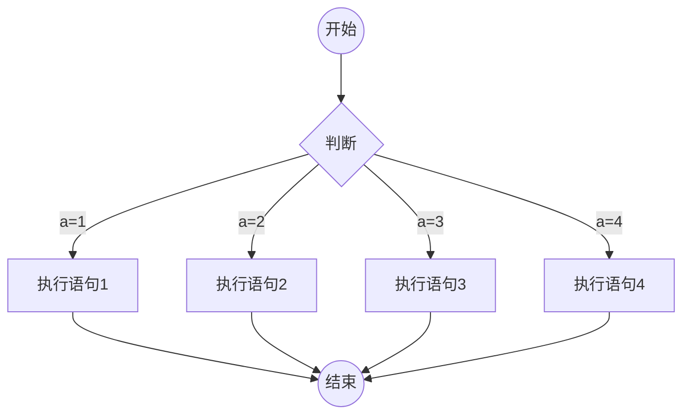
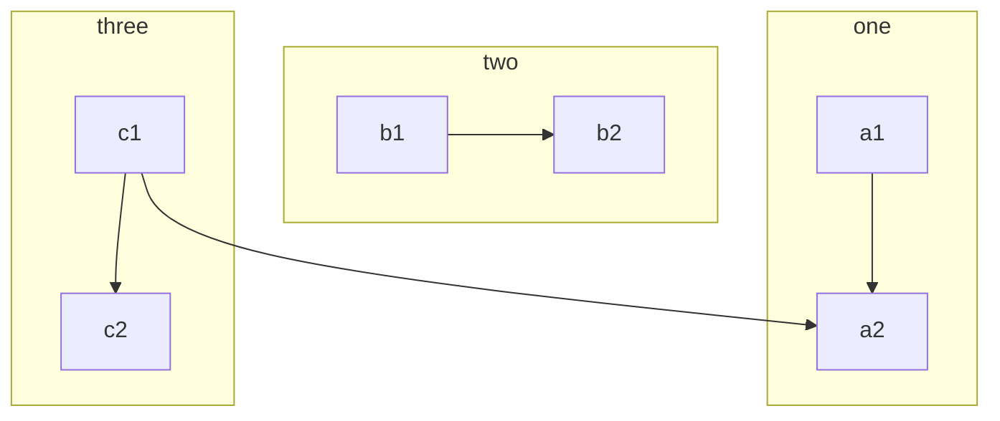
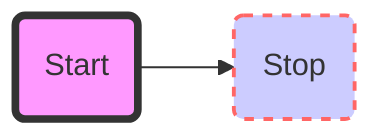
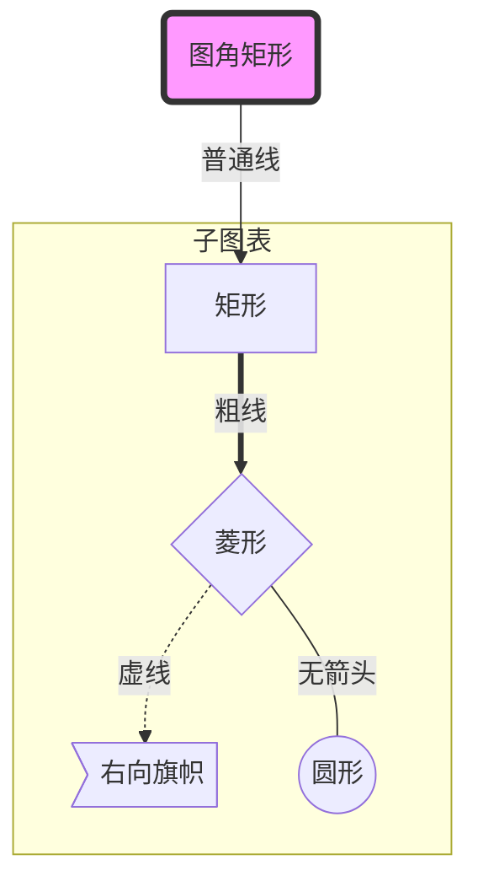
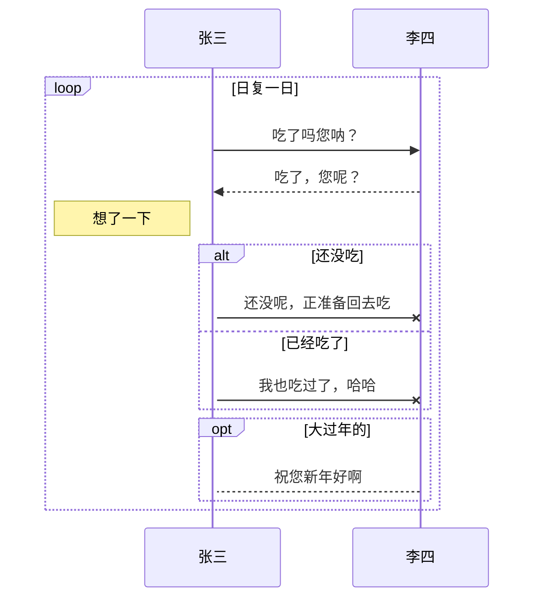

在之前的文章中我尝试绘制过流程图，但是效果不理想，在2021年7月12日的研究学习中成功实现绘制流程图目的。现在记录两种流程图mermaid 和 flowchart.

<!--more-->

# mermaid流程图

## 安装mermaid插件

```
# npm install --save hexo-filter-mermaid-diagrams
```
插件安装完毕，在配置文件\_config.yml中找到mermaid选项，将enable设置为true。

### 流程图举例

#### 源码
```
###mermaid
graph TD
    B((开始)) -->C{判断}
    C -- a=1 --> D[执行语句1]
    C -- a=2 --> E[执行语句2]
    C -- a=3 --> F[执行语句3]
    C -- a=4 --> G[执行语句4]
    D --> AA((结束))
    E --> AA
    F --> AA
    G --> AA
###
```
注意：为了防止转义，将三个单反引号以#取代，实际操作时请代换为三个单反引号。

#### 效果




## 流程图语法

### 方向表达

|方向|含义|
|:--:|:--:|
|TB|从上到下|
|BT|从下到上|
|RL|从右到左|
|LR|从左到右|
|TD|与TB相同|

### 节点

语法结构为： A[名称] --> B(名称)
其中，A、B均代表形状名称，--> 表示箭头指向，形状样式用后面的括号来表示，括号里面的内容是形状中要显示的文本内容。其中有以下几种形状：

|括号形式|形状样式|
|:--:|:--:|
|[]|矩形框|
|()|圆角矩形框|
|{}|菱形|
|(())|圆形|

### 连接线

|符号|箭头|
|:--:|:--:|
|->|箭头|
|-|无箭头|
|-文字-/-\|文字\||带文字的连接线|
|->\|文字\|-/-文字-->|带箭头和文字的连接线|
|-.->|虚线|
|-.文字.->|带文字的虚线连接|
|==>|粗连接线|
|==文本==>|带文本的粗连线|

## 子图

### 子图源码

```
###mermaid
   graph TB
   c1--> a2
   subgraph one
   a1-->a2
   end
   subgraph two
   b1-->b2
   end
   subgraph three
   c1-->c2
   end
###
```

### 子图效果



## 样式链接

### 样式链接源码
```
###mermaid
graph LR
   id1(Start)-->id2(Stop)
   style id1 fill:#f9f,stroke:#333,stroke-width:4px
   style id2 fill:#ccf,stroke:#f66,stroke-width:2px,stroke-dasharray:5,5
###
```

### 样式链接效果


## 综合应用

### 综合应用源码
```
###mermaid
graph TB
    id1(圆角矩形)--普通线-->id2[矩形]
    subgraph 子图表
	id2==粗线==>id3{菱形}
	id3-.虚线.->id4>右向旗帜]
	id3--无箭头---id5((圆形))
    end
    style id1 fill:#f9f,stroke:#333,stroke-width:4px
###
```

### 综合应用效果


## 序列图语法

### 语法内容

```
sequenceDiagram
    [参与者1][消息线][参与者2]:消息本
    ...
```

### 参与者

上例中语法是最简单的，也可以明显表明参与者有哪些，如下
```
sequenceDiagram
    participant 参与者1
    participant 参与者2
    ...
    participant 简称 as 参与者 3 # 该语法可以在接下来的描述中使用简称来代替参与者 312345
```

### 消息线

|类型|描述|
|:--:|:--:|
|->|无箭头的实线|
|-->|无箭头的虚线|
|->>|有箭头的实线|
|-->>|有箭头的虚线|
|-x|末端为叉的实线（表示异步）|
|--x|末端为叉的虚线（表示异步）|

### 处理中

在消息线末尾增加+,则消息接收者进入当前消息的“处理中“状态;
在消息线末尾增加-,则消息接收者离开当前消息的“处理中“状态;

使用以下语法也可以直接说明某个参与者进入”处理中“状态

```
activate 参与者1
```

### 标注

语法为

```
Note 位置表述 参与者：标注文字1
```

其中位置表述可以为

|表述|含义|
|:--:|:--:|
|right of|右侧|
|left of |左侧|
|over |在当中，可以横跨多个参与者|

### 循环

语法为

```
loop 循环的条件
    循环体描述语句
end123
```

### 判断

语法为

```
alt 条件 1 描述
    分支 1 描述语句
else 条件 2 描述 # else 分支可选
    分支 2 描述语句
else ...
    ...
end1234567
```

如果遇到可选的情况，即没有else分支的情况，使用如下语法:

```
opt 条件描述
    分支描述语句
end
```

### 综合应用源码

```
###mermaid
sequenceDiagram
    participant z as 张三
    participant l as 李四
    loop 日复一日
	z->>l: 吃了吗您呐？
	l-->>z: 吃了，您呢？
	activate z
	Note left of z:想了一下
	alt 还没吃
	    z-xl:还没呢，正准备回去吃
	else 已经吃了
	    z-xl:我也吃过了，哈哈
	end
	opt 大过年的
	    l-->z: 祝您新年好啊
	end
    end
###
```

### 综合应用效果



# flowchart流程图

flowchart简便易用，其不如mermaid表达的图丰富，但是就其易性而言，此处也记录其使用。

## 添加flowchart支持

```
# npm install --save hexo-filter-flowchart
```

### 添加flowchart代码

#### flowchart举例源码
```
###flowchart
st=>start: 开始节点
in=>inputoutput: 输入
e=>end: 结束节点
op=>operation: 操作节点
cond=>condition: 条件节点
sub=>subroutine: 子例程
out=>inputoutput: 输出
st(right)->in->op->cond
cond(yes,right)->out->e
cond(no)->sub
###
```
注意：代码前没有空格,如果有空格则不能正确生成流程图。

#### flowchart举例效果

<center>
```flowchart
st=>start: 开始节点
in=>inputoutput: 输入
e=>end: 结束节点
op=>operation: 操作节点
cond=>condition: 条件节点
sub=>subroutine: 子例程
out=>inputoutput: 输出
st(right)->in->op->cond
cond(yes,right)->out->e
cond(no)->sub
```
</center>

## Flow语法结构

### 概述

flow语法直截了当，分为节点定义和节点连接两部分

### 节点定义

语法结构为： x=>Y:z

其中，X是变量名，Y是操作模块名，冒号后面的Z是具体显示的文字内容。需注意冒号后必须有空格才能识别，而X,Y与=>之间不允许有空格。其中变量名X和文字内容Z可以比较随意设置，但Y有固定的内容，主要有以下几种：

|操作模块名|表示含义|
|:--:|:--:|
|start|开始|
|end|结束|
|operation|普通操作块|
|subroutine|子任务块|
|condition|判断块|
|inputoutput|输入输出块|

### 节点连接

1. 定义语法节点后，需要理顺节点之间的关系才能建立正确的流程图;
2. 在flow中使用`->`符号连接两个前后的变量;
3. 如：`a->b->c`,表示节点a转到b又到c节点;
4. 上述转换也可以写成
```
a->b
b->c
```
5. condition是判断，可以取yes和no两种结果，对于不同的结果可以有不同走向。如
```
cond(yes)->out
cond(no)->op
```
yes一行表示，condition成立时转向out执行;no一行表示condition不成立时转向op执行。

### 连接方向

1. 连接线上有上下左右四个方向，如果需指定连接线连接到某一特定方向，在连接线开始的元素后面添加方向即可，方向 包括
```
（top)
(bottom)
(left)
(right)
```
2. 如果要设置条件框连接线方向，在括号中添加即可。条件框只有两个方向可供选择：
```
#yes向下，no向右（默认）
#yes向右，no向下
cond(yes,right)
cond(no,bottom)
```
注意：只需要指定其中一条分支的方向即可。

